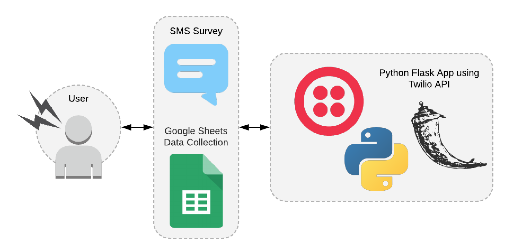

# Automated Survey with for Tracking Migraines


## Technologies

- Python 3
- Flask
- Twilio API
- Google Sheets API

#### Development Stack



## Local Development

1. Clone this repository and `cd` into it.

1. Go to [Google API Manager](https://console.developers.google.com/). Then add Google Drive API to our project which will allow us to access spreadsheet inside of Google Sheets for our account. Once that’s added, we need to create some credentials to access the API so click on ***Add Credentials*** on the next screen you see after enabling the API. This JSON file should be added to the root directory of the repository.

1. Setup a [Twilio account and number](https://www.twilio.com/console).

1. Setup `twilio.env` in the twilio_application directory to contain a secret key using the `twilio.env_example` file. This secret is required for a session in Flask to run. To use this file, remove the `_example` from the filename and add in a secret key and Twilio phone number.

1. Install the requirements.

  ```bash
  pip3 install -r requirements.txt
  ```

1. Start the development server.

  ```bash
  cd automated_survey/
  python3 -m app run # Run the Flask application
  ```

1. Expose your application to the wider internet using ngrok. To forward incoming messages, your development server will need to be publicly accessible.

  ```bash
  ngrok http 5000
  ```

  Once you have started ngrok, update your TwiML app's SMS messaging URL setting to use your ngrok hostname.

  It will look something like this:

  ```bash
  http://demo.ngrok.io/sms
  ```

  Your app's SMS messaging URL can be set in the [Twilio Console](https://www.twilio.com/console) under Active Numbers. Once there, click on your number and scroll to the bottom where it says Messaging. Once there, you will select wehook and insert your ngrok URL.

### Demo

Below, you will see a demo of the application being run:


## Running the tests

You can run the tests locally using pytest.

```bash
python3 -m pytest tests/
```

You can then view the results by building an HTML report with `pytest --cov=automated_survey tests/ --cov-report html`.

## Meta

* No warranty expressed or implied. Software is as is.
* [MIT License](http://www.opensource.org/licenses/mit-license.html)
